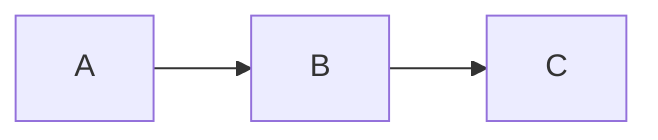

# MDViewer Implementation Plan

> **For Claude:** REQUIRED SUB-SKILL: Use superpowers:executing-plans to implement this plan task-by-task.

**Goal:** Build a native macOS markdown viewer with standalone app, Quick Look extension, and CLI tool.

**Architecture:** Single Xcode project with three targets sharing a common rendering module. Markdown is rendered client-side in a WKWebView using bundled JS libraries (markdown-it, highlight.js, KaTeX, Mermaid). macOS 10.15+ universal binary.

**Tech Stack:** Swift, AppKit (NSDocument), WebKit (WKWebView), JavaScript (markdown-it, highlight.js, KaTeX, Mermaid), Xcode

---

### Task 1: Create Xcode Project Structure

**Files:**
- Create: `MDViewer.xcodeproj` (via Xcode CLI or manual)
- Create: `MDViewer/AppDelegate.swift`
- Create: `MDViewer/Info.plist`
- Create: `MDViewer/MDViewer.entitlements`

**Step 1: Initialize the Xcode project**

Use `swift package init` is not appropriate here — we need a full Xcode project. Create the project structure manually:

```bash
cd /Users/ward/Documents/Projects/MDViewer
mkdir -p MDViewer/Resources
mkdir -p QuickLookExtension
mkdir -p mdview-cli
```

**Step 2: Create the Swift Package for shared rendering**

```bash
mkdir -p MarkdownRenderer/Sources/MarkdownRenderer
mkdir -p MarkdownRenderer/Tests/MarkdownRendererTests
```

Create `MarkdownRenderer/Package.swift`:

```swift
// swift-tools-version:5.5
import PackageDescription

let package = Package(
    name: "MarkdownRenderer",
    platforms: [.macOS(.v10_15)],
    products: [
        .library(name: "MarkdownRenderer", targets: ["MarkdownRenderer"]),
    ],
    targets: [
        .target(
            name: "MarkdownRenderer",
            resources: [.copy("Resources")]
        ),
        .testTarget(
            name: "MarkdownRendererTests",
            dependencies: ["MarkdownRenderer"]
        ),
    ]
)
```

**Step 3: Create minimal AppDelegate**

Create `MDViewer/AppDelegate.swift`:

```swift
import Cocoa

@main
class AppDelegate: NSObject, NSApplicationDelegate {
    func applicationDidFinishLaunching(_ notification: Notification) {
    }

    func applicationShouldOpenUntitledFile(_ sender: NSApplication) -> Bool {
        return false
    }
}
```

**Step 4: Verify the directory structure exists**

```bash
find /Users/ward/Documents/Projects/MDViewer -type f -not -path '*/.git/*' | head -30
```

**Step 5: Initialize git and commit**

```bash
cd /Users/ward/Documents/Projects/MDViewer
git init
cat > .gitignore << 'GITIGNORE'
.DS_Store
build/
DerivedData/
*.xcuserdata
*.xcworkspace
!*.xcodeproj
xcuserdata/
*.moved-aside
*.hmap
*.ipa
*.dSYM.zip
*.dSYM
node_modules/
GITIGNORE
git add -A
git commit -m "chore: initialize MDViewer project structure"
```

---

### Task 2: Download and Bundle JS/CSS Dependencies

**Files:**
- Create: `MarkdownRenderer/Sources/MarkdownRenderer/Resources/render.html`
- Create: `MarkdownRenderer/Sources/MarkdownRenderer/Resources/markdown-it.min.js`
- Create: `MarkdownRenderer/Sources/MarkdownRenderer/Resources/markdown-it-task-lists.min.js`
- Create: `MarkdownRenderer/Sources/MarkdownRenderer/Resources/highlight.min.js`
- Create: `MarkdownRenderer/Sources/MarkdownRenderer/Resources/highlight-default.min.css`
- Create: `MarkdownRenderer/Sources/MarkdownRenderer/Resources/katex.min.js`
- Create: `MarkdownRenderer/Sources/MarkdownRenderer/Resources/katex.min.css`
- Create: `MarkdownRenderer/Sources/MarkdownRenderer/Resources/auto-render.min.js`
- Create: `MarkdownRenderer/Sources/MarkdownRenderer/Resources/mermaid.min.js`
- Create: `MarkdownRenderer/Sources/MarkdownRenderer/Resources/style.css`

**Step 1: Download markdown-it and plugins**

```bash
RESOURCES="MarkdownRenderer/Sources/MarkdownRenderer/Resources"
mkdir -p "$RESOURCES"

# markdown-it (CommonMark + GFM tables/strikethrough)
curl -L -o "$RESOURCES/markdown-it.min.js" \
  "https://cdn.jsdelivr.net/npm/markdown-it@14/dist/markdown-it.min.js"

# Task list plugin
curl -L -o "$RESOURCES/markdown-it-task-lists.min.js" \
  "https://cdn.jsdelivr.net/npm/markdown-it-task-lists@2/markdown-it-task-lists.min.js"
```

**Step 2: Download highlight.js**

```bash
# highlight.js with common languages
curl -L -o "$RESOURCES/highlight.min.js" \
  "https://cdn.jsdelivr.net/gh/highlightjs/cdn-release/build/highlight.min.js"

# Default stylesheet
curl -L -o "$RESOURCES/highlight-default.min.css" \
  "https://cdn.jsdelivr.net/gh/highlightjs/cdn-release/build/styles/default.min.css"

# GitHub-style dark theme
curl -L -o "$RESOURCES/highlight-github-dark.min.css" \
  "https://cdn.jsdelivr.net/gh/highlightjs/cdn-release/build/styles/github-dark.min.css"

# GitHub-style light theme
curl -L -o "$RESOURCES/highlight-github.min.css" \
  "https://cdn.jsdelivr.net/gh/highlightjs/cdn-release/build/styles/github.min.css"
```

**Step 3: Download KaTeX**

```bash
# KaTeX JS
curl -L -o "$RESOURCES/katex.min.js" \
  "https://cdn.jsdelivr.net/npm/katex@0.16/dist/katex.min.js"

# KaTeX CSS
curl -L -o "$RESOURCES/katex.min.css" \
  "https://cdn.jsdelivr.net/npm/katex@0.16/dist/katex.min.css"

# Auto-render extension (finds and renders math in text)
curl -L -o "$RESOURCES/auto-render.min.js" \
  "https://cdn.jsdelivr.net/npm/katex@0.16/dist/contrib/auto-render.min.js"

# KaTeX fonts directory
mkdir -p "$RESOURCES/fonts"
for font in KaTeX_Main-Regular KaTeX_Main-Bold KaTeX_Main-Italic KaTeX_Main-BoldItalic KaTeX_Math-Italic KaTeX_Math-BoldItalic KaTeX_Size1-Regular KaTeX_Size2-Regular KaTeX_Size3-Regular KaTeX_Size4-Regular KaTeX_AMS-Regular KaTeX_Caligraphic-Regular KaTeX_Caligraphic-Bold KaTeX_Fraktur-Regular KaTeX_Fraktur-Bold KaTeX_SansSerif-Regular KaTeX_SansSerif-Bold KaTeX_SansSerif-Italic KaTeX_Script-Regular KaTeX_Typewriter-Regular; do
  curl -L -o "$RESOURCES/fonts/${font}.woff2" \
    "https://cdn.jsdelivr.net/npm/katex@0.16/dist/fonts/${font}.woff2"
done
```

**Step 4: Download Mermaid**

```bash
curl -L -o "$RESOURCES/mermaid.min.js" \
  "https://cdn.jsdelivr.net/npm/mermaid@10/dist/mermaid.min.js"
```

**Step 5: Verify all downloads succeeded**

```bash
ls -la "$RESOURCES/"
# All .js and .css files should be non-empty
wc -c "$RESOURCES"/*.js "$RESOURCES"/*.css
```

**Step 6: Commit**

```bash
git add -A
git commit -m "chore: bundle JS/CSS rendering dependencies"
```

---

### Task 3: Create the HTML Render Template and CSS

**Files:**
- Create: `MarkdownRenderer/Sources/MarkdownRenderer/Resources/render.html`
- Create: `MarkdownRenderer/Sources/MarkdownRenderer/Resources/style.css`

**Step 1: Create style.css**

```css
:root {
    --text-color: #24292f;
    --bg-color: #ffffff;
    --link-color: #0969da;
    --code-bg: #f6f8fa;
    --border-color: #d0d7de;
    --blockquote-color: #57606a;
    --heading-color: #24292f;
}

@media (prefers-color-scheme: dark) {
    :root {
        --text-color: #e6edf3;
        --bg-color: #0d1117;
        --link-color: #58a6ff;
        --code-bg: #161b22;
        --border-color: #30363d;
        --blockquote-color: #8b949e;
        --heading-color: #e6edf3;
    }
}

* {
    box-sizing: border-box;
}

body {
    font-family: -apple-system, BlinkMacSystemFont, "Segoe UI", "Noto Sans",
        Helvetica, Arial, sans-serif;
    font-size: 16px;
    line-height: 1.6;
    color: var(--text-color);
    background-color: var(--bg-color);
    max-width: 880px;
    margin: 0 auto;
    padding: 32px 24px;
    word-wrap: break-word;
}

h1, h2, h3, h4, h5, h6 {
    color: var(--heading-color);
    margin-top: 24px;
    margin-bottom: 16px;
    font-weight: 600;
    line-height: 1.25;
}

h1 { font-size: 2em; padding-bottom: 0.3em; border-bottom: 1px solid var(--border-color); }
h2 { font-size: 1.5em; padding-bottom: 0.3em; border-bottom: 1px solid var(--border-color); }
h3 { font-size: 1.25em; }
h4 { font-size: 1em; }

a {
    color: var(--link-color);
    text-decoration: none;
}
a:hover {
    text-decoration: underline;
}

code {
    font-family: ui-monospace, SFMono-Regular, "SF Mono", Menlo, Consolas, monospace;
    font-size: 85%;
    background-color: var(--code-bg);
    padding: 0.2em 0.4em;
    border-radius: 6px;
}

pre {
    background-color: var(--code-bg);
    border-radius: 6px;
    padding: 16px;
    overflow-x: auto;
    line-height: 1.45;
}

pre code {
    background: none;
    padding: 0;
    font-size: 85%;
}

blockquote {
    color: var(--blockquote-color);
    border-left: 4px solid var(--border-color);
    margin: 0 0 16px 0;
    padding: 0 16px;
}

table {
    border-collapse: collapse;
    width: 100%;
    margin-bottom: 16px;
}

th, td {
    border: 1px solid var(--border-color);
    padding: 6px 13px;
}

th {
    font-weight: 600;
    background-color: var(--code-bg);
}

img {
    max-width: 100%;
    height: auto;
}

hr {
    border: none;
    border-top: 1px solid var(--border-color);
    margin: 24px 0;
}

ul, ol {
    padding-left: 2em;
}

li + li {
    margin-top: 4px;
}

/* Task list checkboxes */
.task-list-item {
    list-style-type: none;
    margin-left: -1.5em;
}

.task-list-item input[type="checkbox"] {
    margin-right: 0.5em;
}

/* Mermaid diagrams */
.mermaid {
    text-align: center;
    margin: 16px 0;
}
```

**Step 2: Create render.html**

```html
<!DOCTYPE html>
<html>
<head>
    <meta charset="utf-8">
    <meta name="viewport" content="width=device-width, initial-scale=1">
    <link rel="stylesheet" href="style.css">
    <link rel="stylesheet" href="katex.min.css">
    <link rel="stylesheet" href="highlight-github.min.css"
          media="(prefers-color-scheme: light)">
    <link rel="stylesheet" href="highlight-github-dark.min.css"
          media="(prefers-color-scheme: dark)">
    <script src="markdown-it.min.js"></script>
    <script src="markdown-it-task-lists.min.js"></script>
    <script src="highlight.min.js"></script>
    <script src="katex.min.js"></script>
    <script src="auto-render.min.js"></script>
    <script src="mermaid.min.js"></script>
</head>
<body>
    <div id="content"></div>
    <script>
        // Initialize markdown-it with highlight.js
        var md = window.markdownit({
            html: true,
            linkify: true,
            typographer: true,
            highlight: function(str, lang) {
                if (lang && hljs.getLanguage(lang)) {
                    try {
                        return hljs.highlight(str, { language: lang }).value;
                    } catch (_) {}
                }
                return ''; // use external default escaping
            }
        }).use(window.markdownitTaskLists);

        function renderMarkdown(markdownText) {
            // Render markdown to HTML
            var html = md.render(markdownText);
            document.getElementById('content').innerHTML = html;

            // Render KaTeX math expressions
            renderMathInElement(document.getElementById('content'), {
                delimiters: [
                    {left: '$$', right: '$$', display: true},
                    {left: '$', right: '$', display: false},
                    {left: '\\(', right: '\\)', display: false},
                    {left: '\\[', right: '\\]', display: true}
                ],
                throwOnError: false
            });

            // Render Mermaid diagrams
            // Find code blocks with class "language-mermaid" and convert them
            var codeBlocks = document.querySelectorAll('pre code.language-mermaid');
            codeBlocks.forEach(function(block, index) {
                var pre = block.parentElement;
                var div = document.createElement('div');
                div.className = 'mermaid';
                div.textContent = block.textContent;
                pre.parentElement.replaceChild(div, pre);
            });

            mermaid.initialize({
                startOnLoad: false,
                theme: window.matchMedia('(prefers-color-scheme: dark)').matches
                    ? 'dark' : 'default'
            });
            mermaid.run();
        }

        // Listen for theme changes to re-render Mermaid
        window.matchMedia('(prefers-color-scheme: dark)').addEventListener('change', function() {
            // Re-render Mermaid with new theme
            var mermaidDivs = document.querySelectorAll('.mermaid');
            if (mermaidDivs.length > 0) {
                mermaid.initialize({
                    startOnLoad: false,
                    theme: window.matchMedia('(prefers-color-scheme: dark)').matches
                        ? 'dark' : 'default'
                });
                // Mermaid needs IDs cleared to re-render
                mermaidDivs.forEach(function(div) {
                    div.removeAttribute('data-processed');
                });
                mermaid.run();
            }
        });

        // renderMarkdown will be called from Swift via evaluateJavaScript
    </script>
</body>
</html>
```

**Step 3: Verify the files are created and non-empty**

```bash
wc -l MarkdownRenderer/Sources/MarkdownRenderer/Resources/render.html \
      MarkdownRenderer/Sources/MarkdownRenderer/Resources/style.css
```

**Step 4: Commit**

```bash
git add -A
git commit -m "feat: add HTML render template and CSS with light/dark theme"
```

---

### Task 4: Build the Shared MarkdownRenderer Swift Module

**Files:**
- Create: `MarkdownRenderer/Sources/MarkdownRenderer/MarkdownRenderer.swift`
- Test: `MarkdownRenderer/Tests/MarkdownRendererTests/MarkdownRendererTests.swift`

**Step 1: Write the failing test**

Create `MarkdownRenderer/Tests/MarkdownRendererTests/MarkdownRendererTests.swift`:

```swift
import XCTest
@testable import MarkdownRenderer

final class MarkdownRendererTests: XCTestCase {
    func testResourceBundleContainsRenderHTML() throws {
        let renderer = MarkdownRenderer()
        let htmlURL = try XCTUnwrap(renderer.renderTemplateURL)
        let contents = try String(contentsOf: htmlURL, encoding: .utf8)
        XCTAssertTrue(contents.contains("renderMarkdown"))
    }

    func testGenerateHTMLProducesValidPage() throws {
        let renderer = MarkdownRenderer()
        let html = try renderer.generateHTML(markdown: "# Hello\n\nWorld")
        XCTAssertTrue(html.contains("<script"))
        XCTAssertTrue(html.contains("renderMarkdown"))
        XCTAssertTrue(html.contains("# Hello"))
    }
}
```

**Step 2: Run test to verify it fails**

```bash
cd MarkdownRenderer
swift test 2>&1 | tail -20
```

Expected: Compilation error — `MarkdownRenderer` type not found.

**Step 3: Write the implementation**

Create `MarkdownRenderer/Sources/MarkdownRenderer/MarkdownRenderer.swift`:

```swift
import Foundation

public class MarkdownRenderer {
    public init() {}

    /// URL to the render.html template in the bundle
    public var renderTemplateURL: URL? {
        Bundle.module.url(forResource: "render", withExtension: "html", subdirectory: "Resources")
    }

    /// URL to the Resources directory containing all JS/CSS assets
    public var resourcesDirectoryURL: URL? {
        Bundle.module.url(forResource: "Resources", withExtension: nil)
    }

    /// Generate a complete HTML page that will render the given markdown.
    /// The markdown is embedded as a JS string and rendered client-side.
    public func generateHTML(markdown: String) throws -> String {
        guard let templateURL = renderTemplateURL else {
            throw RendererError.missingTemplate
        }
        var template = try String(contentsOf: templateURL, encoding: .utf8)

        // Escape the markdown for safe embedding in a JS string literal
        let escaped = markdown
            .replacingOccurrences(of: "\\", with: "\\\\")
            .replacingOccurrences(of: "`", with: "\\`")
            .replacingOccurrences(of: "$", with: "\\$")

        // Inject a script that calls renderMarkdown with the content
        let injection = """
        <script>
        document.addEventListener('DOMContentLoaded', function() {
            renderMarkdown(`\(escaped)`);
        });
        </script>
        """

        template = template.replacingOccurrences(of: "</body>", with: "\(injection)\n</body>")
        return template
    }

    public enum RendererError: Error, LocalizedError {
        case missingTemplate

        public var errorDescription: String? {
            switch self {
            case .missingTemplate:
                return "Could not find render.html template in bundle"
            }
        }
    }
}
```

**Step 4: Run tests to verify they pass**

```bash
cd MarkdownRenderer
swift test 2>&1 | tail -20
```

Expected: Both tests PASS.

**Step 5: Commit**

```bash
git add -A
git commit -m "feat: add MarkdownRenderer shared module with HTML generation"
```

---

### Task 5: Build the Standalone Viewer — Document Class

**Files:**
- Create: `MDViewer/MarkdownDocument.swift`

**Step 1: Create MarkdownDocument.swift**

```swift
import Cocoa
import WebKit

class MarkdownDocument: NSDocument {
    var markdownContent: String = ""
    private var fileMonitor: DispatchSourceFileSystemObject?
    private var fileDescriptor: Int32 = -1

    override init() {
        super.init()
    }

    override class var autosavesInPlace: Bool {
        return false
    }

    override var isEntireFileLoaded: Bool {
        return true
    }

    // MARK: - Reading

    override func read(from url: URL, ofType typeName: String) throws {
        markdownContent = try String(contentsOf: url, encoding: .utf8)
        startMonitoringFile(at: url)
    }

    override func read(from data: Data, ofType typeName: String) throws {
        guard let content = String(data: data, encoding: .utf8) else {
            throw NSError(domain: NSOSStatusErrorDomain, code: unimpErr, userInfo: nil)
        }
        markdownContent = content
    }

    // We don't support writing
    override func write(to url: URL, ofType typeName: String) throws {
        throw NSError(domain: NSOSStatusErrorDomain, code: unimpErr, userInfo: nil)
    }

    override func makeWindowControllers() {
        let controller = MarkdownWindowController()
        addWindowController(controller)
    }

    // MARK: - File Monitoring

    private func startMonitoringFile(at url: URL) {
        stopMonitoringFile()

        fileDescriptor = open(url.path, O_EVTONLY)
        guard fileDescriptor >= 0 else { return }

        let source = DispatchSource.makeFileSystemObjectSource(
            fileDescriptor: fileDescriptor,
            eventMask: [.write, .rename, .delete],
            queue: .main
        )

        source.setEventHandler { [weak self] in
            guard let self = self, let fileURL = self.fileURL else { return }
            if let newContent = try? String(contentsOf: fileURL, encoding: .utf8) {
                self.markdownContent = newContent
                self.notifyWindowControllersOfChange()
            }
        }

        source.setCancelHandler { [weak self] in
            guard let self = self else { return }
            if self.fileDescriptor >= 0 {
                close(self.fileDescriptor)
                self.fileDescriptor = -1
            }
        }

        source.resume()
        fileMonitor = source
    }

    private func stopMonitoringFile() {
        fileMonitor?.cancel()
        fileMonitor = nil
    }

    private func notifyWindowControllersOfChange() {
        for controller in windowControllers {
            if let mdController = controller as? MarkdownWindowController {
                mdController.reloadContent()
            }
        }
    }

    deinit {
        stopMonitoringFile()
    }
}
```

**Step 2: Verify it compiles (will be tested as part of Xcode project later)**

This file depends on `MarkdownWindowController` which we create next. Just verify the file is saved correctly.

**Step 3: Commit**

```bash
git add -A
git commit -m "feat: add MarkdownDocument with file monitoring for live reload"
```

---

### Task 6: Build the Standalone Viewer — Window Controller and WebView

**Files:**
- Create: `MDViewer/MarkdownWindowController.swift`

**Step 1: Create MarkdownWindowController.swift**

```swift
import Cocoa
import WebKit

class MarkdownWindowController: NSWindowController, WKNavigationDelegate {
    private var webView: WKWebView!

    convenience init() {
        // Create the window programmatically
        let window = NSWindow(
            contentRect: NSRect(x: 0, y: 0, width: 800, height: 600),
            styleMask: [.titled, .closable, .miniaturizable, .resizable],
            backing: .buffered,
            defer: false
        )
        window.center()
        window.setFrameAutosaveName("MDViewerWindow")
        window.minSize = NSSize(width: 400, height: 300)

        self.init(window: window)

        // Create WKWebView
        let config = WKWebViewConfiguration()
        config.preferences.setValue(true, forKey: "allowFileAccessFromFileURLs")

        webView = WKWebView(frame: window.contentView!.bounds, configuration: config)
        webView.autoresizingMask = [.width, .height]
        webView.navigationDelegate = self
        window.contentView?.addSubview(webView)
    }

    override func windowDidLoad() {
        super.windowDidLoad()
        loadContent()
    }

    override func showWindow(_ sender: Any?) {
        super.showWindow(sender)
        loadContent()
    }

    func reloadContent() {
        loadContent()
    }

    private func loadContent() {
        guard let document = document as? MarkdownDocument else { return }

        let renderer = MarkdownRenderer()
        guard let html = try? renderer.generateHTML(markdown: document.markdownContent),
              let resourcesURL = renderer.resourcesDirectoryURL else {
            return
        }

        webView.loadHTMLString(html, baseURL: resourcesURL)
    }

    // MARK: - WKNavigationDelegate

    // Open links in the default browser instead of in the viewer
    func webView(_ webView: WKWebView,
                 decidePolicyFor navigationAction: WKNavigationAction,
                 decisionHandler: @escaping (WKNavigationActionPolicy) -> Void) {
        if navigationAction.navigationType == .linkActivated,
           let url = navigationAction.request.url {
            NSWorkspace.shared.open(url)
            decisionHandler(.cancel)
        } else {
            decisionHandler(.allow)
        }
    }
}
```

**Step 2: Commit**

```bash
git add -A
git commit -m "feat: add MarkdownWindowController with WKWebView rendering"
```

---

### Task 7: Create the Xcode Project File

**Files:**
- Create: `MDViewer.xcodeproj/project.pbxproj`
- Create: `MDViewer/Info.plist`
- Create: `MDViewer/MDViewer.entitlements`

This task is best done in Xcode directly. The engineer should:

**Step 1: Create Xcode project**

Open Xcode and create a new macOS App project:
- Product Name: MDViewer
- Team: (Your Developer ID)
- Organization Identifier: (your reverse-domain, e.g., `net.fiddlythings`)
- Interface: XIB (AppKit, not SwiftUI — for broadest compatibility)
- Language: Swift
- Save in: `/Users/ward/Documents/Projects/MDViewer`

**Step 2: Configure project settings**

- Deployment Target: macOS 10.15
- Architectures: Standard Architectures (Apple Silicon, Intel) — `ARCHS_STANDARD`
- Enable Hardened Runtime in Signing & Capabilities
- Add `com.apple.security.network.client` entitlement (for loading local resources in WKWebView)

**Step 3: Add the MarkdownRenderer local package**

In Xcode: File → Add Package Dependencies → Add Local → select `MarkdownRenderer/`

Add `MarkdownRenderer` library as a dependency of the MDViewer target.

**Step 4: Configure document types in Info.plist**

Add to the target's Info.plist (or via Xcode's Document Types editor):

```xml
<key>CFBundleDocumentTypes</key>
<array>
    <dict>
        <key>CFBundleTypeName</key>
        <string>Markdown Document</string>
        <key>CFBundleTypeRole</key>
        <string>Viewer</string>
        <key>LSHandlerRank</key>
        <string>Alternate</string>
        <key>LSItemContentTypes</key>
        <array>
            <string>net.daringfireball.markdown</string>
            <string>public.plain-text</string>
        </array>
        <key>CFBundleTypeExtensions</key>
        <array>
            <string>md</string>
            <string>markdown</string>
            <string>mdown</string>
            <string>mkd</string>
        </array>
    </dict>
</array>
<key>UTImportedTypeDeclarations</key>
<array>
    <dict>
        <key>UTTypeIdentifier</key>
        <string>net.daringfireball.markdown</string>
        <key>UTTypeDescription</key>
        <string>Markdown Document</string>
        <key>UTTypeConformsTo</key>
        <array>
            <string>public.plain-text</string>
        </array>
        <key>UTTypeTagSpecification</key>
        <dict>
            <key>public.filename-extension</key>
            <array>
                <string>md</string>
                <string>markdown</string>
                <string>mdown</string>
                <string>mkd</string>
            </array>
        </dict>
    </dict>
</array>
```

**Step 5: Remove the default storyboard/XIB**

Delete `Main.storyboard` or `MainMenu.xib` if generated. We build the UI programmatically. Update Info.plist to remove `NSMainStoryboardFile` / `NSMainNibFile`.

Keep or recreate a minimal `MainMenu.xib` that contains only the menu bar (File > Open, Print, Quit, etc.). Alternatively, build the menu programmatically in AppDelegate.

**Step 6: Add existing Swift files to the target**

Add `AppDelegate.swift`, `MarkdownDocument.swift`, and `MarkdownWindowController.swift` to the MDViewer target.

**Step 7: Build and verify**

```bash
xcodebuild -project MDViewer.xcodeproj -scheme MDViewer -arch arm64 -arch x86_64 build 2>&1 | tail -20
```

Expected: BUILD SUCCEEDED

**Step 8: Test by opening a markdown file**

```bash
# Create a test file
cat > /tmp/test.md << 'MD'
# Hello MDViewer

This is a **test** with some `inline code`.

## Code Block

```python
def hello():
    print("world")
```

## Table

| Name | Value |
|------|-------|
| Foo  | Bar   |

## Math

$$E = mc^2$$

## Mermaid



- [x] Task 1
- [ ] Task 2
MD

open -a MDViewer /tmp/test.md
```

**Step 9: Commit**

```bash
git add -A
git commit -m "feat: configure Xcode project with document types and universal binary"
```

---

### Task 8: Build the Quick Look Extension

**Files:**
- Create: `QuickLookExtension/PreviewViewController.swift`
- Create: `QuickLookExtension/Info.plist`

**Step 1: Add Quick Look Preview Extension target in Xcode**

In Xcode: File → New → Target → Quick Look Preview Extension
- Product Name: `QuickLookExtension`
- Embed in Application: MDViewer

**Step 2: Configure the extension's Info.plist**

Ensure `QLSupportedContentTypes` includes:

```xml
<key>NSExtension</key>
<dict>
    <key>NSExtensionAttributes</key>
    <dict>
        <key>QLSupportedContentTypes</key>
        <array>
            <string>net.daringfireball.markdown</string>
            <string>public.plain-text</string>
        </array>
        <key>QLSupportsSearchableItems</key>
        <false/>
    </dict>
    <key>NSExtensionPointIdentifier</key>
    <string>com.apple.quicklook.preview</string>
    <key>NSExtensionPrincipalClass</key>
    <string>$(PRODUCT_MODULE_NAME).PreviewViewController</string>
</dict>
```

**Step 3: Implement PreviewViewController.swift**

```swift
import Cocoa
import Quartz
import WebKit

class PreviewViewController: NSViewController, QLPreviewingController, WKNavigationDelegate {
    private var webView: WKWebView!

    override func loadView() {
        let config = WKWebViewConfiguration()
        config.preferences.setValue(true, forKey: "allowFileAccessFromFileURLs")

        webView = WKWebView(frame: NSRect(x: 0, y: 0, width: 600, height: 400), configuration: config)
        webView.navigationDelegate = self
        self.view = webView
    }

    func preparePreviewOfFile(at url: URL, completionHandler handler: @escaping (Error?) -> Void) {
        do {
            let markdown = try String(contentsOf: url, encoding: .utf8)
            let renderer = MarkdownRenderer()
            let html = try renderer.generateHTML(markdown: markdown)

            if let resourcesURL = renderer.resourcesDirectoryURL {
                webView.loadHTMLString(html, baseURL: resourcesURL)
            } else {
                webView.loadHTMLString(html, baseURL: nil)
            }
            handler(nil)
        } catch {
            handler(error)
        }
    }

    // Open links in browser
    func webView(_ webView: WKWebView,
                 decidePolicyFor navigationAction: WKNavigationAction,
                 decisionHandler: @escaping (WKNavigationActionPolicy) -> Void) {
        if navigationAction.navigationType == .linkActivated,
           let url = navigationAction.request.url {
            NSWorkspace.shared.open(url)
            decisionHandler(.cancel)
        } else {
            decisionHandler(.allow)
        }
    }
}
```

**Step 4: Add MarkdownRenderer package dependency to the extension target**

In Xcode, add `MarkdownRenderer` library to the QuickLookExtension target's frameworks.

**Step 5: Build and test**

```bash
xcodebuild -project MDViewer.xcodeproj -scheme MDViewer build 2>&1 | tail -10
```

After building, run the app once to register the extension, then test:

```bash
qlmanage -p /tmp/test.md
```

Expected: Quick Look preview window shows rendered markdown.

**Step 6: Commit**

```bash
git add -A
git commit -m "feat: add Quick Look preview extension for markdown files"
```

---

### Task 9: Build the CLI Tool

**Files:**
- Create: `mdview-cli/main.swift`

**Step 1: Create main.swift**

```swift
import Foundation

// Minimal CLI — no ArgumentParser dependency for maximum compatibility
let args = CommandLine.arguments

func printUsage() {
    let usage = """
    Usage: mdview [options] <file.md>

    Options:
      --html              Output rendered HTML to stdout
      --html -o <file>    Write rendered HTML to file
      -h, --help          Show this help message

    Without --html, opens the file in MDViewer.app.
    """
    print(usage)
}

func openInApp(path: String) {
    let absolutePath = URL(fileURLWithPath: path).path
    let task = Process()
    task.launchPath = "/usr/bin/open"
    task.arguments = ["-a", "MDViewer", absolutePath]
    task.launch()
    task.waitUntilExit()

    if task.terminationStatus != 0 {
        fputs("Error: Could not open MDViewer.app\n", stderr)
        exit(1)
    }
}

func renderToHTML(inputPath: String, outputPath: String?) {
    do {
        let markdown = try String(contentsOfFile: inputPath, encoding: .utf8)

        // Load the render template from the app bundle's Resources
        // When installed, mdview lives at MDViewer.app/Contents/Resources/mdview
        let binaryURL = URL(fileURLWithPath: CommandLine.arguments[0]).resolvingSymlinksInPath()
        let resourcesDir = binaryURL.deletingLastPathComponent()

        guard let templateURL = Optional(resourcesDir.appendingPathComponent("render.html")),
              FileManager.default.fileExists(atPath: templateURL.path) else {
            fputs("Error: Could not find render.html template\n", stderr)
            exit(1)
        }

        var template = try String(contentsOf: templateURL, encoding: .utf8)

        let escaped = markdown
            .replacingOccurrences(of: "\\", with: "\\\\")
            .replacingOccurrences(of: "`", with: "\\`")
            .replacingOccurrences(of: "$", with: "\\$")

        let injection = """
        <script>
        document.addEventListener('DOMContentLoaded', function() {
            renderMarkdown(`\(escaped)`);
        });
        </script>
        """

        template = template.replacingOccurrences(of: "</body>", with: "\(injection)\n</body>")

        if let outputPath = outputPath {
            try template.write(toFile: outputPath, atomically: true, encoding: .utf8)
        } else {
            print(template)
        }
    } catch {
        fputs("Error: \(error.localizedDescription)\n", stderr)
        exit(1)
    }
}

// Parse arguments
guard args.count >= 2 else {
    printUsage()
    exit(1)
}

if args[1] == "-h" || args[1] == "--help" {
    printUsage()
    exit(0)
}

if args[1] == "--html" {
    guard args.count >= 3 else {
        fputs("Error: --html requires a markdown file argument\n", stderr)
        exit(1)
    }

    if args[2] == "-o" {
        guard args.count >= 5 else {
            fputs("Error: -o requires output path and input file\n", stderr)
            exit(1)
        }
        renderToHTML(inputPath: args[4], outputPath: args[3])
    } else {
        renderToHTML(inputPath: args[2], outputPath: nil)
    }
} else {
    openInApp(path: args[1])
}
```

**Step 2: Add CLI target in Xcode**

In Xcode: File → New → Target → macOS → Command Line Tool
- Product Name: `mdview`
- Add to project: MDViewer

Configure the build phase to copy `mdview` binary into `MDViewer.app/Contents/Resources/` after build.

**Step 3: Add "Install Command Line Tool" menu item**

Add to `AppDelegate.swift`:

```swift
@IBAction func installCommandLineTool(_ sender: Any) {
    let alert = NSAlert()
    alert.messageText = "Install Command Line Tool"
    alert.informativeText = "This will create a symlink at /usr/local/bin/mdview pointing to the CLI tool inside MDViewer.app."
    alert.addButton(withTitle: "Install")
    alert.addButton(withTitle: "Cancel")

    guard alert.runModal() == .alertFirstButtonReturn else { return }

    let source = Bundle.main.resourceURL!.appendingPathComponent("mdview").path
    let destination = "/usr/local/bin/mdview"

    let script = """
    ln -sf '\(source)' '\(destination)'
    """

    let task = Process()
    task.launchPath = "/usr/bin/osascript"
    task.arguments = ["-e", "do shell script \"\(script)\" with administrator privileges"]
    task.launch()
    task.waitUntilExit()

    let result = NSAlert()
    if task.terminationStatus == 0 {
        result.messageText = "Installed"
        result.informativeText = "You can now use 'mdview' from the terminal."
    } else {
        result.messageText = "Installation Failed"
        result.informativeText = "Could not create symlink. You may need to do it manually."
    }
    result.runModal()
}
```

Wire this to a menu item: MDViewer → Install Command Line Tool.

**Step 4: Build and test**

```bash
xcodebuild -project MDViewer.xcodeproj -scheme MDViewer build 2>&1 | tail -10

# Test the CLI
./build/Release/MDViewer.app/Contents/Resources/mdview --html /tmp/test.md | head -20
```

**Step 5: Commit**

```bash
git add -A
git commit -m "feat: add mdview CLI tool with HTML export"
```

---

### Task 10: Signing, Notarization, and DMG

**Files:**
- Create: `scripts/build-release.sh`

**Step 1: Create the release build script**

Create `scripts/build-release.sh`:

```bash
#!/bin/bash
set -euo pipefail

DEVELOPER_ID="Developer ID Application: YOUR NAME (TEAM_ID)"
APP_NAME="MDViewer"
SCHEME="MDViewer"
BUILD_DIR="build/Release"
DMG_NAME="MDViewer.dmg"

echo "=== Building universal binary ==="
xcodebuild -project "${APP_NAME}.xcodeproj" \
    -scheme "$SCHEME" \
    -configuration Release \
    -archivePath "build/${APP_NAME}.xcarchive" \
    archive \
    ARCHS="arm64 x86_64" \
    ONLY_ACTIVE_ARCH=NO

echo "=== Exporting archive ==="
xcodebuild -exportArchive \
    -archivePath "build/${APP_NAME}.xcarchive" \
    -exportOptionsPlist ExportOptions.plist \
    -exportPath "$BUILD_DIR"

echo "=== Verifying code signature ==="
codesign --verify --deep --strict "${BUILD_DIR}/${APP_NAME}.app"
spctl --assess --type execute "${BUILD_DIR}/${APP_NAME}.app"

echo "=== Notarizing ==="
xcrun notarytool submit "${BUILD_DIR}/${APP_NAME}.app" \
    --keychain-profile "notarization-profile" \
    --wait

echo "=== Stapling ==="
xcrun stapler staple "${BUILD_DIR}/${APP_NAME}.app"

echo "=== Creating DMG ==="
hdiutil create -volname "$APP_NAME" \
    -srcfolder "$BUILD_DIR/${APP_NAME}.app" \
    -ov -format UDZO \
    "build/${DMG_NAME}"

echo "=== Notarizing DMG ==="
xcrun notarytool submit "build/${DMG_NAME}" \
    --keychain-profile "notarization-profile" \
    --wait

xcrun stapler staple "build/${DMG_NAME}"

echo "=== Done ==="
echo "Output: build/${DMG_NAME}"
```

**Step 2: Create ExportOptions.plist**

```xml
<?xml version="1.0" encoding="UTF-8"?>
<!DOCTYPE plist PUBLIC "-//Apple//DTD PLIST 1.0//EN" "http://www.apple.com/DTDs/PropertyList-1.0.dtd">
<plist version="1.0">
<dict>
    <key>method</key>
    <string>developer-id</string>
    <key>teamID</key>
    <string>YOUR_TEAM_ID</string>
</dict>
</plist>
```

**Step 3: Make the script executable and commit**

```bash
chmod +x scripts/build-release.sh
git add -A
git commit -m "chore: add release build script with signing and notarization"
```

---

### Task 11: End-to-End Testing

**Step 1: Build the complete app**

```bash
xcodebuild -project MDViewer.xcodeproj -scheme MDViewer -configuration Debug build
```

**Step 2: Test standalone viewer**

```bash
open -a build/Debug/MDViewer.app /tmp/test.md
```

Verify:
- Window opens with rendered markdown
- Headers, bold, code blocks, tables render correctly
- Syntax highlighting colors appear in code block
- Math equation renders as formatted formula
- Mermaid diagram renders as SVG graphic
- Task list checkboxes appear
- Toggle system dark/light mode → styles update
- Links open in default browser

**Step 3: Test live reload**

```bash
# With the viewer open on /tmp/test.md:
echo "## Added by live reload test" >> /tmp/test.md
```

Verify: New heading appears in the viewer without manual action.

**Step 4: Test Quick Look**

```bash
qlmanage -p /tmp/test.md
```

Verify: Quick Look preview shows rendered markdown.

**Step 5: Test CLI**

```bash
./build/Debug/MDViewer.app/Contents/Resources/mdview /tmp/test.md
./build/Debug/MDViewer.app/Contents/Resources/mdview --html /tmp/test.md > /tmp/test-output.html
open /tmp/test-output.html  # should open in browser with rendered markdown
```

**Step 6: Test drag-and-drop**

Drag a `.md` file from Finder onto the MDViewer app icon in the Dock.

**Step 7: Commit any fixes**

```bash
git add -A
git commit -m "fix: address issues found during end-to-end testing"
```
